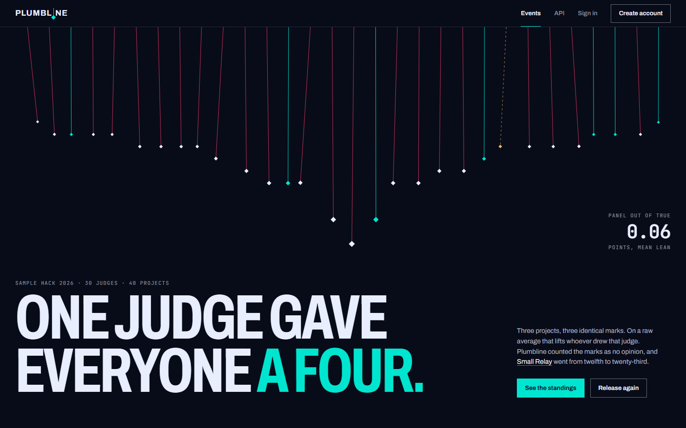
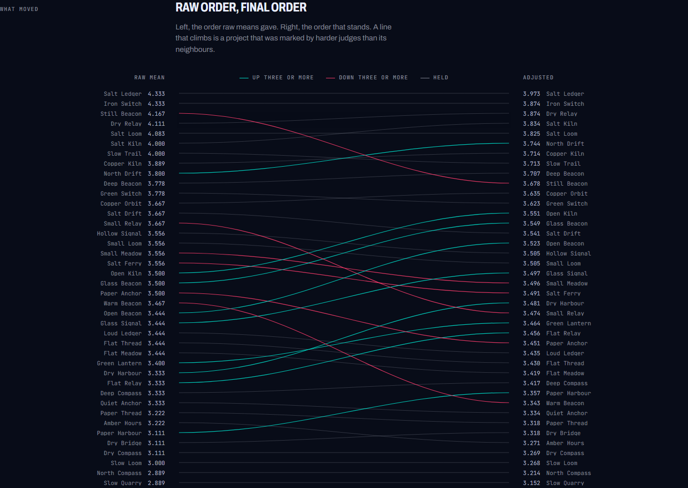
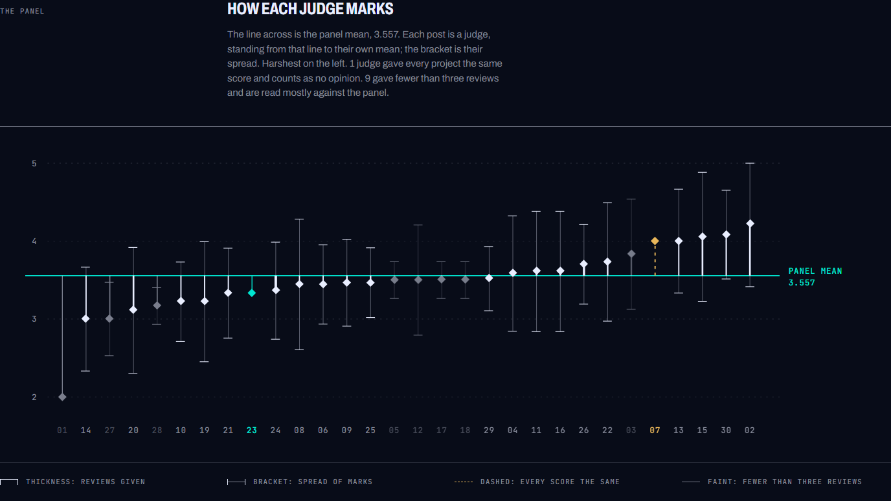
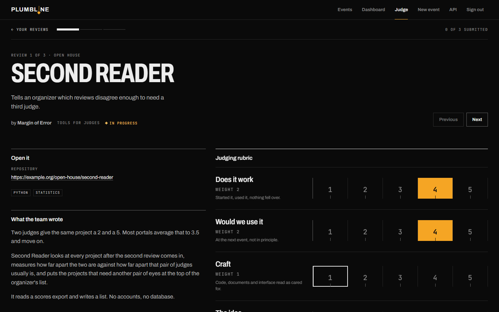
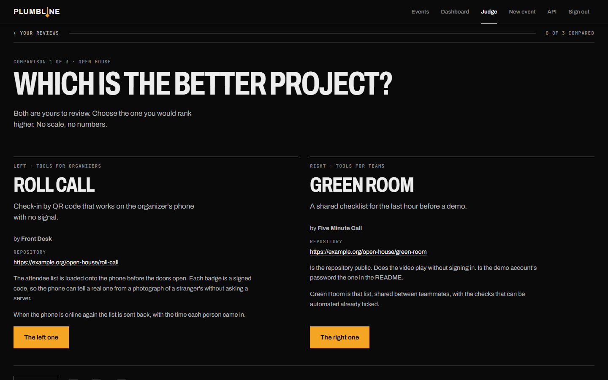
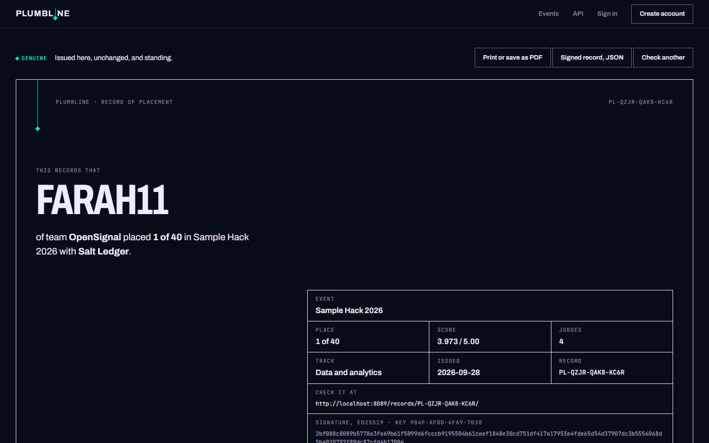
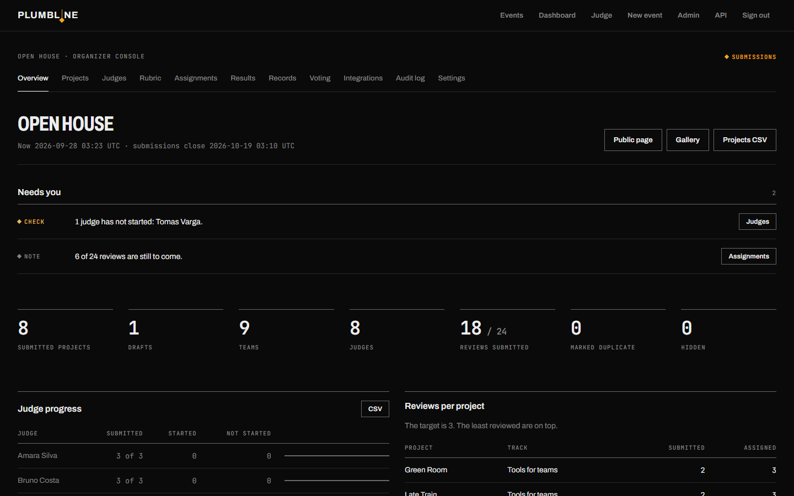
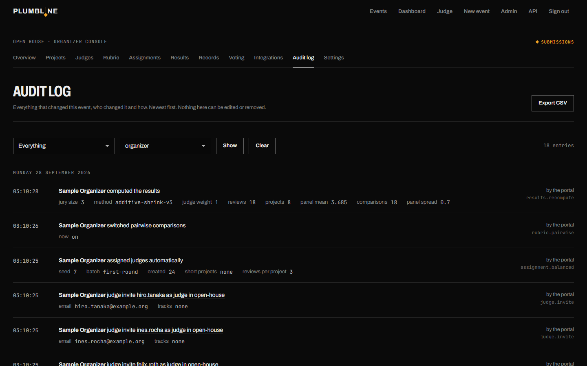
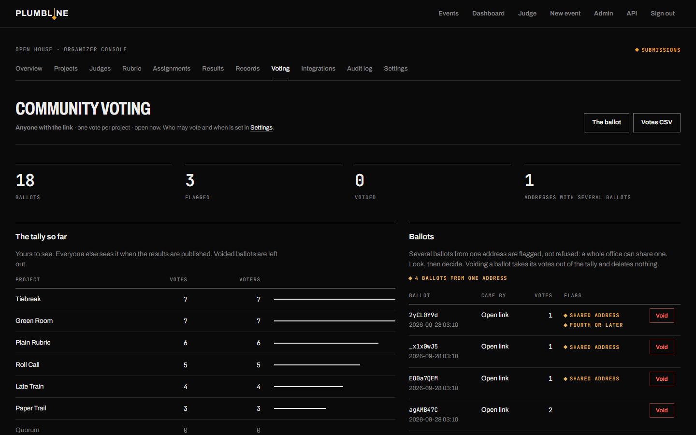

# Plumbline

A self-hostable hackathon submission and judging portal. Built in 72 hours for
[DOGFOOD 2026](https://dogfoodhack.com/) by Hackathon Raptors.

A plumb line is the weighted string a builder hangs to check that a wall is
truly vertical. This portal is built around the same idea: judging that is
straight because the backend holds the line, not because a button is hidden.



## What is different here

Every judging portal averages scores. An average believes a judge who gave
everyone a four as much as one who thought about it, and it rewards the
project that happened to draw the generous judges. Plumbline shows the
organizer how far each judge hangs from the panel, corrects for it with a
method written down in [JUDGING.md](JUDGING.md), and publishes both orders
side by side so that anyone can see what the correction did.

The method was measured before it was believed. On simulated events where
the true order is known, it is compared with a raw average and with the
standard scores most portals use, and the tables are printed as they came
out, the one where it loses included:
[docs/normalization-evidence.md](docs/normalization-evidence.md). The
portal's first method lost that comparison and was replaced on the second
day.

| | |
|---|---|
|  |  |
| **Results, public.** The order raw means gave, the order that stands, and a line for every project that moved. | **Organizer console.** Each judge's mean and spread against the panel. The judge who gave every project the same score is dashed and counts as no opinion. |
|  |  |
| **Judge console.** Number keys score, the sheet saves itself, *submit and next* moves on. Made for thirty projects in a sitting. | **Pairwise mode.** Which of two is better, ranked with a Bradley-Terry model beside the rubric. |
|  |  |
| **Signed records.** A certificate with a number and an Ed25519 signature that anyone can check, with the portal or without it. | **Dashboard.** What needs attention before results can be published, and nothing else. |
|  |  |
| **Audit log.** Who did what to what, as sentences, with the value before and after. | **Community vote.** The tally, and the ballots that came from one address, flagged and not refused. |

The charts are drawn by the server as SVG. There is no chart library, no
CDN and no build step; the pages work with scripts switched off. The design
rules are in [docs/DESIGN.md](docs/DESIGN.md) and live at `/styleguide/`.

## Run it

```sh
docker compose up
```

That is the whole procedure. It builds the image, starts PostgreSQL, applies
migrations, loads the organizer's `fixtures.json` (idempotently), prints the
four auth headers used by `.dogfood.toml`, and serves on
<http://localhost:8080>. No network is needed after the image is built.

Then check it:

```sh
python3 checker/run.py .dogfood.toml --fixtures fixtures.json > acceptance-report.txt
```

The committed [`acceptance-report.txt`](acceptance-report.txt) is that command's
output against this repository.

### Five minutes with it

The portal starts with two events.

**Sample Hack 2026** is the organizer's fixture set, loaded as it is: forty
projects, thirty judges, every review submitted, results published. It is
the event the checker runs against and the one to compare portals on.

**Open House** is ours. Every window in it is open, so that there is
something to do: eight projects with real descriptions, reviews waiting for
the two seeded judges, a ballot, prizes, form questions, comments. It says
on its own page that it is not part of the fixture set.
`PLUMBLINE_SEED_OPEN_HOUSE=0` leaves it out.

The sign-in page of a sample installation lists the accounts below and fills
the form in for you.

| minute | as | do | you are looking at |
|---|---|---|---|
| 1 | nobody | open `/`, then *See the standings* | the published results: raw order, final order, what moved |
| 2 | judge (Wei) | *Judge*, Open House, score a project with the number keys, then *Compare in pairs* | the judge console and pairwise mode (T2, bonus) |
| 3 | judge (Wei) | open `/api/judges/jdg_01/scores` | 403: another judge's scores are refused by the server, not hidden by the page |
| 4 | nobody | Open House, *Open your ballot*, mark two projects | community voting, random order per voter (T3) |
| 5 | organizer | Open House console: *Voting* (four ballots from one address are flagged), *Results* (recompute, publish), *Records* (issue, open a certificate, check it at `/verify/`), *Audit log* | the organizer's side of all of it (T2, T3, T4) |

### Seeded logins

All seeded accounts use the password `plumbline`. Sign in with email or username.

| role | email | what you can do |
|---|---|---|
| admin | `admin@example.org` | everything, plus `/admin/` |
| organizer | `organizer@example.org` | the organizer console for *Sample Hack 2026* |
| judge | `tomas.varga@example.org` (jdg_01) | the judge console; one submitted review in Sample Hack, three waiting in Open House |
| judge | `wei.lindqvist@example.org` (jdg_02) | the judge console; six submitted reviews in Sample Hack, three waiting in Open House |
| participant | `priya1@example.org` | team *NorthKiln*, project *Glass Signal*; free to form a team in Open House |

Every fixture judge and team member exists as a user with the same password.

### Where things are

| | |
|---|---|
| Gallery | `/events/sample-hack-2026/gallery/` |
| Organizer console | `/events/sample-hack-2026/organize/` |
| Judge console | `/judge/` |
| Community ballot | `/events/open-house/ballot/` (the fixture event has no community vote) |
| Judge console with work waiting | `/judge/open-house/` |
| API docs (OpenAPI) | `/api/docs` — served from the image, no CDN |
| Django admin | `/admin/` |

## What it does

**T1 Core.** Accounts and sessions; five roles (visitor, participant, judge,
organizer, admin); events with UTC dates, tracks and prizes; teams formed by
invite link; project submission with the full standard field set plus
organizer-defined custom questions; draft-and-edit until the deadline, which
the server enforces the moment it passes; a public gallery with search and
track filter.

**T2 Judging.** Judge invitation by email with optional track restriction;
balanced automatic assignment (k reviews per project, even load, track-aware,
never your own team, reproducible with a seed) plus manual assignment; a
weighted, organizer-configurable rubric; a judge console designed for scoring
thirty projects in a sitting (keyboard scoring, submit-and-next); role
isolation enforced in the backend (a judge can only ever load their own
assignments, through the UI, the API and the exports); a live progress
dashboard; cross-judge normalization and a jury-size adjustment, with a
documented method, measurements against a known truth, a generated proof
and a second implementation that
checks the first; results published as adjusted score, scale and number of
judges, with the mean of every criterion and a per-track view; CSV export at every stage; an append-only audit log an
organizer reads in the browser.

**T3 Public.** Community voting with three access modes (open link,
organizer-issued email ballot links, signed-in users), optional quadratic
voting, comments on gallery projects with organizer moderation, results hidden
from everyone but organizers until published, randomised ballot order that is
stable per voter, rate limits shared across workers, duplicate-ballot flagging
by address, and voidable ballots that are never deleted.

**T4 Stretch.** Every UI action is also an API call with a published OpenAPI
schema and bearer tokens. Data leaves as CSV (projects, assignments, scores,
results, calibration, votes, audit) and, for a full migration, `pg_dump`.
Webhooks subscribe to an event's audit stream: signed with HMAC-SHA256, sent
after the change is committed, recorded per delivery and retryable. Invited
judges get in through a one-time sign-in link the organizer passes on.

**Signed records (T4).** Once results are published the organizer issues a
record to every member of every ranked team and to every judge who submitted
a review. Each opens as a certificate that prints on one page, carries a
number and an Ed25519 signature. Anyone can check the signature on their
own machine, with no portal running and nothing installed:

```sh
python tools/verify_record.py record.json --key <the public key from /verify/key.json>
```

Whether a record still stands is asked of the portal, at `/verify/` or
`POST /api/records/check`: genuine, withdrawn, not standing, altered or
unknown. A judge's record says that they judged and how much, never what
they scored. A record whose place changed after a recompute is withdrawn and
replaced, so there is never more than one to believe.

**Pairwise mode (bonus).** Beside the rubric, judges can be asked which of
two of their projects is the better one. The comparisons are ranked with a
Bradley-Terry model (MM algorithm, a weak prior so that unbeaten projects
and disconnected groups stay finite) and shown next to the rubric ranking
with their agreement. An organizer switches it on in the console, under
*Rubric*, or with `PATCH /api/events/<slug>/judging/method`. Method and tests in [JUDGING.md](JUDGING.md), section
5; the model on the fixture data in
[docs/pairwise-proof.md](docs/pairwise-proof.md).

## Tier claim

`.dogfood.toml` claims **T1, T2, T3 and T4**.

| tier | verified by | report |
|---|---|---|
| T1, T2 | the official `checker/run.py`, 7 probes | `acceptance-report.txt` |
| T3, T4 | `tools/verify_tiers.py`, 58 probes in the same manner | `acceptance-report-t3-t4.txt` |

The official checker has probes for T1 and T2 only, so it prints T3 and T4
as *claimed but not verified*. That line is true of the checker, not of the
portal. Rather than ask for the two upper tiers to be taken on trust, the
repository carries a second program that does for them what `run.py` does
for the lower two: it reads the same `.dogfood.toml`, uses the same four
headers, makes requests to the running portal, and prints PASS or FAIL.
It needs only the standard library.

```sh
python checker/run.py .dogfood.toml --fixtures fixtures.json
python tools/verify_tiers.py .dogfood.toml
```

What each upper tier asks for, and where it is:

| asked for | where |
|---|---|
| T3 community voting: email gated, link based or authenticated | Settings, *Who may vote*; `/events/<slug>/ballot/` |
| T3 project comments | project page; `POST /api/events/<slug>/projects/<id>/comments` |
| T3 results hidden during the voting window | 403 on the page and the API until published |
| T3 randomized project ordering on ballots | per voter, stable across reloads |
| T3 anti abuse: rate limits, duplicate detection, audit trail | [docs/THREAT-MODEL.md](docs/THREAT-MODEL.md); console, *Voting* and *Audit log* |
| T4 REST API and webhooks | `/api/docs`; console, *Integrations* |
| T4 certificate and record generation | console, *Records*; `/records/<number>/` |
| T4 signed, publicly verifiable judge participation records | `/verify/`; `POST /api/records/check` |
| T4 embeddable gallery widget | `/events/<slug>/embed/gallery/`; snippet in *Integrations* |
| T4 bulk import and export | console, *Settings*, *Import*; `POST /api/events/<slug>/import`; CSV exports |

## What it does not do yet

- File uploads: thumbnails and gallery images are URLs.
- Outbound email. Judges and ballot links are created by the organizer and
  distributed with whatever mail tool they already use.

## Before a real event

`docker compose up` with no settings is a **sample installation**: the
secret key, the seeded accounts (password `plumbline`, one of them an
administrator) and the four API tokens are the ones printed in this README
and in `.dogfood.toml`. That is what makes the checker work on a fresh
clone, and it is fine on your own machine. The container says so at start,
and staff see a notice on every page until it is no longer true.

For a real event set `DJANGO_SECRET_KEY`, `PLUMBLINE_SEED=0`,
`ALLOWED_HOSTS` and `PLUMBLINE_SITE_URL`, create your own administrator,
and remove the seeded accounts if the sample was ever loaded.

## Running it for real

Copy `.env.example` to `.env` and set:

| variable | default | notes |
|---|---|---|
| `DJANGO_SECRET_KEY` | dev value | **change it** |
| `PLUMBLINE_SEED` | `1` | set `0` so the fixtures are not loaded |
| `PLUMBLINE_SEED_PUBLISH` | `1` | the sample event is loaded finished, with results published; `0` leaves that to the organizer |
| `PLUMBLINE_SEED_OPEN_HOUSE` | `1` | also load *Open House*, an event with every window open, to try the portal in |
| `PLUMBLINE_SEED_SECRET` | dev value | only matters when seeding |
| `ALLOWED_HOSTS` | `*` | your hostname |
| `CSRF_TRUSTED_ORIGINS` | `http://localhost:8080,…` | your origin, with scheme |
| `DJANGO_DEBUG` | `0` | leave it |
| `PLUMBLINE_SITE_NAME` | `Plumbline` | shown in the header |
| `PLUMBLINE_RECORDS_KEY` | empty | what the key that signs records is made from; empty means the secret key. Set it once and keep it, and the secret key can be changed without the records issued so far failing their check |
| `PLUMBLINE_SITE_URL` | empty | your public address, such as `https://judging.example.org`; printed on certificates and in the links you send |
| `PLUMBLINE_ANON_WRITE_RATE` | `20` | anonymous writes per minute per address |
| `PLUMBLINE_TRUST_PROXY` | `0` | set `1` only behind a proxy you run; see below |
| `PLUMBLINE_WEBHOOK_ALLOW_PRIVATE` | `0` | set `1` if webhook receivers live on your own network |
| `PLUMBLINE_PORT` | `8080` | the port on the host |
| `GUNICORN_WORKERS` | `2` | processes |
| `GUNICORN_THREADS` | `8` | threads per process; browsers hold idle connections, so keep this above 4 |

Put a TLS-terminating proxy in front of port 8080, have it set
`X-Forwarded-For`, and set `PLUMBLINE_TRUST_PROXY=1` so rate limits and the
audit log see real addresses. Leave it at `0` when the port is reached
directly: the header is then whatever the caller typed.

The fixtures are loaded once. Later starts read them only to print the
checker headers; they never put back a score, a judge or an account that
someone has changed or removed since. The seeded accounts share a published
password, so for a real event start with `PLUMBLINE_SEED=0`.
Create the first organizer with `docker compose exec web python manage.py createsuperuser`,
then create an event at `/events/new/`.

Backups: `docker compose exec -T db pg_dump -U plumbline plumbline > backup.sql`.
Restoring into an empty database:
`docker compose exec -T db psql -U plumbline plumbline < backup.sql`.
Keep `DJANGO_SECRET_KEY` (or `PLUMBLINE_RECORDS_KEY`) with the backup: the
records in it are signed with a key made from that value.
Leaving: the CSV exports in the organizer console cover every table an
organizer cares about; `pg_dump` covers the rest.

The audit log is written to be read: each entry is a sentence, who did
what to what, with the values before and after. The stored entries and the
CSV keep the action names and the JSON detail for programs.

## Development

```sh
pip install -r requirements.txt
python manage.py migrate && python manage.py createcachetable
python manage.py seed_fixtures fixtures.json
python manage.py runserver 8080
python manage.py test tests            # 395 tests, 5 to 12 minutes
python manage.py normalization_report sample-hack-2026 > docs/normalization-proof.md
python manage.py normalization_evidence sample-hack-2026 > docs/normalization-evidence.md
```

Without `DATABASE_URL` the development server uses SQLite; Docker uses PostgreSQL.

## Documents

- [ARCHITECTURE.md](ARCHITECTURE.md) — the shape of the system and why
- [DATA-MODEL.md](DATA-MODEL.md) — schema, and how data gets in and out
- [JUDGING.md](JUDGING.md) — assignment strategy, scoring maths, normalization, defended
- [docs/normalization-evidence.md](docs/normalization-evidence.md) — does the method find the true order? Measured
- [docs/normalization-proof.md](docs/normalization-proof.md) — the method run on the fixture data
- [docs/pairwise-proof.md](docs/pairwise-proof.md) — the pairwise model run on the fixture data
- [docs/THREAT-MODEL.md](docs/THREAT-MODEL.md) — voting and submission abuse: what is stopped, what is not
- [DECISIONS.md](DECISIONS.md) — what was decided, what was given up for it
- [docs/DESIGN.md](docs/DESIGN.md) — the design rules, and why the pages look the way they do

## License

MIT. `fixtures.json` and `checker/run.py` are the organizer's files, included
unchanged so the checker runs from a clean clone.
